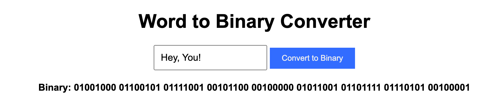

<h1 align="center">bin-lib</h1>
<p align="center">
  <strong>Convert Words to Binary</strong>
</p>

<p align="center">
  
</p>

[](https://www.npmjs.com/package/@sharshar/word-to-bin-lib)

[](https://www.npmjs.com/package/@sharshar/word-to-bin-lib)

[](https://www.npmjs.com/package/@sharshar/word-to-bin-lib)

[npm package link](https://www.npmjs.com/package/@sharshar/word-to-bin-lib)

## Table of Contents

- [About](#about)
- [Features](#features)
- [Getting Started](#getting-started)
  - [Installation](#installation)
  - [Usage](#usage)
- [Examples](#examples)
- [Contributing](#contributing)
- [License](#license)

## About

**bin-lib** is a minimalistic library that allows you to convert words and text into binary code. 

Whether you want to convert your name to binary or explore the world of ones and zeros, **bin-lib** has got you.

## Features

- Convert words and text to binary with ease.
- Handle mixed-case input and characters not in the mapping.
- Transform spaces, numbers, and special characters into their binary representations.
- Enjoy clean and minimalistic code for your binary adventures.

## Getting Started

### Installation

To get started with **bin-lib**, you'll need to install it in your project. You can do this using npm or yarn.

```bash
npm install bin-lib
# or
yarn add bin-lib
